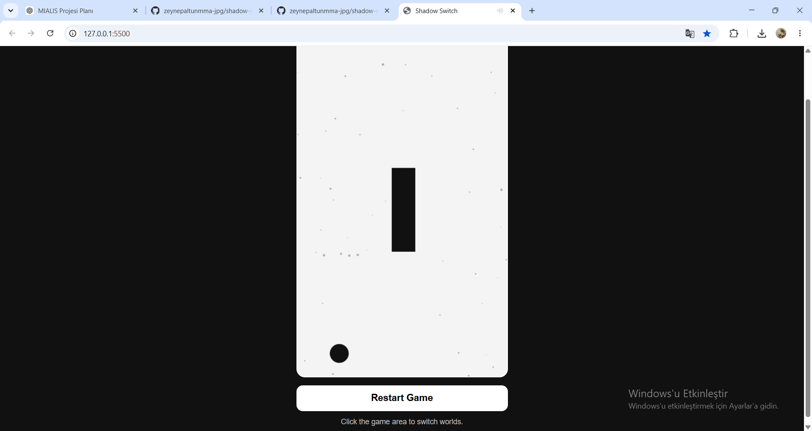

# 🌗 Shadow Switch

Shadow Switch is a fast-paced HTML5 Canvas game where players switch between the Light and Dark worlds to survive incoming obstacles.

---

## 🎮 Gameplay

The player moves automatically up and down.

Click anywhere on the canvas to switch between worlds.

Visible obstacles depend on the active world.

Survive as long as possible and beat your High Score.

---

## ✨ Features

- 🌗 Light / Dark World Switching
- ⭐ High Score System (LocalStorage)
- 💥 Particle Effects
- 🌌 Animated Star Background
- 🎵 Sound Effects
- 💀 Game Over Screen
- 🔄 Restart Game
- 📱 Responsive Design

---

## 🛠 Technologies

- HTML5
- CSS3
- JavaScript (ES6)
- Canvas API
- LocalStorage

---

## 🎮 Controls

| Action | Control |
|--------|---------|
| Switch World | Left Mouse Click |
| Start Game | Start Button |
| Restart | Play Again Button |

---

## 📷 Screenshot

Example:

---

## 🚀 Live Demo

Coming Soon...

---

## 👩‍💻 Developer

**Zeynep Altun**

GitHub:
https://github.com/zeynepaltunmma-jpg

---

Made with ❤️ using HTML, CSS and JavaScript.
